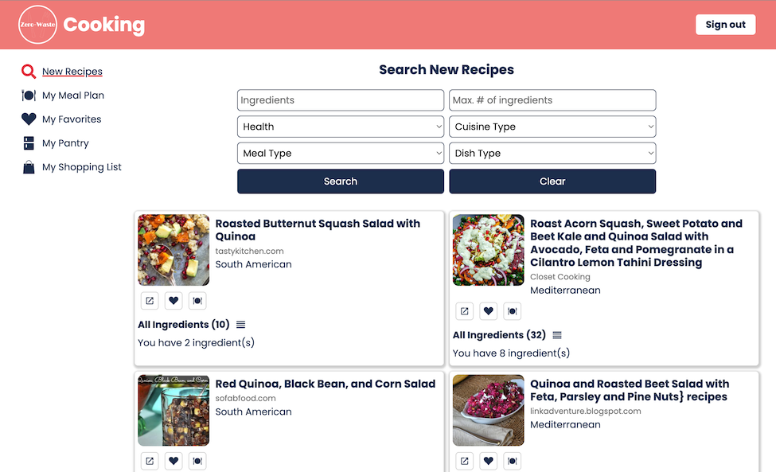

# ZeroWasteCooking



This application helps people find recipes based on what they have at home 
in order to reduce food waste and facilitate meal planning. 

Logged in users can 
- save recipes.
- add a private note on a saved recipe.
- create a list of foods they have at home.
- create a shopping list from saved recipes.

[View web application demo](https://youtu.be/SImMqaoXD-E)

---

## Project Setup

To run this application, you need an account with the following services:
- [auth0](https://auth0.com/)
- [Edamam Recipe Search API](https://developer.edamam.com/edamam-recipe-api)
- [MongoDB Atlas](https://www.mongodb.com/atlas/database)

### The Client
- Create a `.env` file in the `client` folder to store the following variables:
  ```html
  REACT_APP_AUTH0_DOMAIN=<YOUR_AUTH0_DOMAIN>
  REACT_APP_AUTH0_CLIENTID=<YOUR_AUTH0_CLIENTID>
  ```
- Run `npm run start` to start the client dev environment.

### The Server
- Create a `.env` file in the `server` folder to store the following variables:
  ```html
  MONGO_URI=<YOUR_MONGO_URI>
  EDAMAM_app_id=<YOUR_EDAMAM_app_id>
  EDAMAM_app_key=<YOUR_EDAMAM_app_key>
  ```
- Run `npm run start` to start the server dev environment.